# 📋 Storage Architecture Plan (Supabase & Google Drive)

**Target Directory:** `Resume-Builder-integration01/backend`  
**Storage Architecture:**
* 📸 **Profile Avatars / Photos:** Stored in **Supabase Storage** (`avatars` bucket) with public CDN URLs saved in `users.profile_picture`.
* 📄 **Finalized Resumes / Vault:** Stored in **Google Drive** in dedicated per-user folders (`User_<user_id>`).

---

## 🏗️ Architecture Overview

```mermaid
flowchart TD
    subgraph Photos["1. Profile Photos (Supabase Storage)"]
        UserUpload["User uploads photo"] --> PhotoEndpoint["POST /api/v1/auth/me/photo"]
        PhotoEndpoint --> SupabaseService["app/services/supabase_storage.py"]
        SupabaseService --> SupabaseBucket["Supabase Storage Bucket: 'avatars'"]
        SupabaseBucket -->|Public CDN URL| DBUser["users.profile_picture (DB)"]
        DBUser --> FrontendRender["Frontend Navbar / Profile Image"]
    end

    subgraph Resumes["2. Finalized Resumes (Google Drive)"]
        UserSave["User exports/saves resume"] --> ResumeEndpoint["POST /api/v1/resumes/"]
        ResumeEndpoint --> DriveService["app/services/drive_service.py"]
        DriveService --> GDriveFolder["Google Drive: User_<id> Folder"]
        GDriveFolder --> GDriveFile["PDF / DOCX / .enc Vault File"]
        GDriveFile -->|drive_file_id| DBResume["resume_documents table"]
    end
```

---

## 🛠️ Step-by-Step Status

### ✅ Step 1: Supabase Avatar Storage (Completed)
1. **Service Created (`app/services/supabase_storage.py`)**:
   * Uses Supabase Storage REST API with upsert support (`x-upsert: true`).
   * Automatically sets public CDN URL: `{SUPABASE_URL}/storage/v1/object/public/{bucket}/user_{user_id}.{ext}`.
   * Auto-creates the public bucket if it doesn't already exist.
2. **Endpoint Refactored (`app/api/v1/auth.py`)**:
   * `POST /api/v1/auth/me/photo` receives image, validates size & MIME type, uploads directly to Supabase, and updates `current_user.profile_picture`.

---

### ✅ Step 2: Finalized Resumes in Google Drive (`app/services/drive_service.py` & `resumes.py`) (Completed)
1. Ensure `POST /api/v1/resumes/` cleanly handles:
   * Encrypted vault backup files (`.enc`).
   * Generated / finalized resume exports (PDF / DOCX / LaTeX).
2. Ensure download endpoints (`GET /api/v1/resumes/{id}/download`) stream files with correct `Content-Disposition` and `Content-Type`.

---

### ✅ Step 3: Environment Variables Checklist (Completed)
* `SUPABASE_URL`: Connected
* `SUPABASE_SERVICE_ROLE_KEY`: Connected
* `GOOGLE_DRIVE_CLIENT_ID`: Connected (Using OAuth Refresh Tokens to bypass quota limits)
* `GOOGLE_DRIVE_CLIENT_SECRET`: Connected 
* `GOOGLE_DRIVE_REFRESH_TOKEN`: Connected
* `GOOGLE_DRIVE_FOLDER_ID`: Connected
